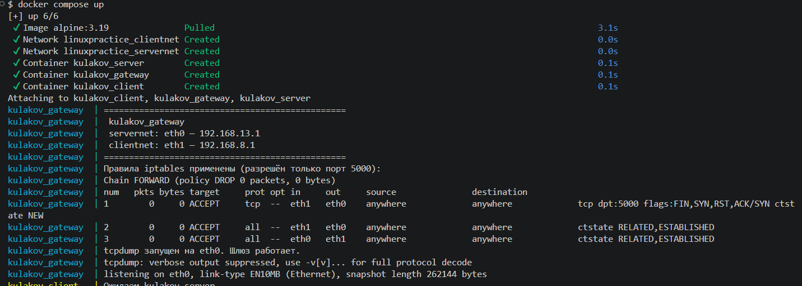
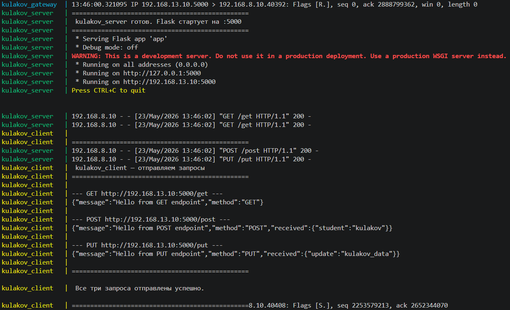
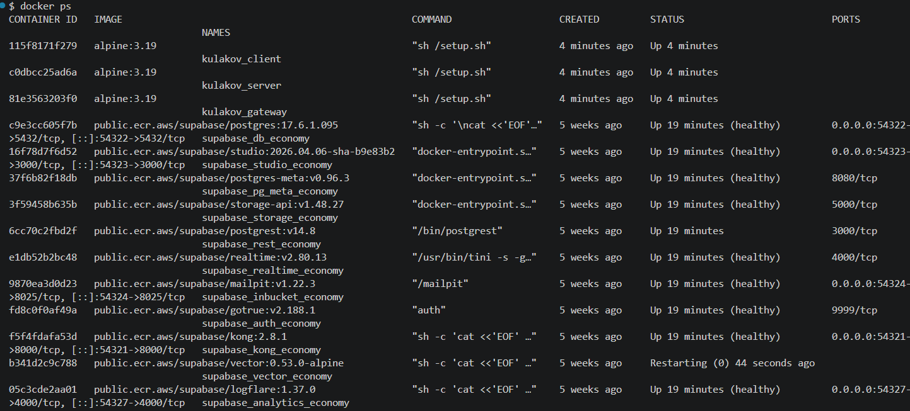

# Отчёт по практической работе «Администрирование Linux»

**Студент:** Кулаков Родион Андреевич  
**Дата выполнения:** 23.05.2026  
**Инструмент:** Docker Desktop (Alpine Linux 3.19)

---

## 1. Задание

Развернуть три Linux-машины по следующей схеме:

- **Linux A (kulakov_server)** — HTTP-сервер на порту 5000 с тремя эндпоинтами: `/get`, `/post`, `/put`
- **Linux B (kulakov_gateway)** — шлюз между A и C, пропускает только TCP-трафик на порт 5000
- **Linux C (kulakov_client)** — клиент, отправляет три HTTP-запроса на сервер через шлюз

---

## 2. Топология сети

```
[kulakov_client]           [kulakov_gateway]           [kulakov_server]
 192.168.8.10   <─clientnet─>  192.168.8.1
                               192.168.13.1  <─servernet─>  192.168.13.10
```

IP-адреса составлены на основе даты рождения **13.08.2003**:
- `13` (день) → последний октет подсети servernet: `192.168.13.x`
- `8` (месяц) → последний октет подсети clientnet: `192.168.8.x`

---

## 3. Структура проекта

```
linuxPractice/
├── application/
│   └── app.py                              — Flask HTTP-сервер
├── configs/
│   ├── linux_a/
│   │   ├── netplan/00-installer-config.yaml
│   │   └── systemd/web-server.service
│   ├── linux_b/
│   │   ├── netplan/00-installer-config.yaml
│   │   └── iptables/setup_iptables.sh
│   └── linux_c/
│       └── netplan/00-installer-config.yaml
├── scripts/
│   ├── setup_linux_a.sh
│   ├── setup_linux_b.sh
│   └── setup_linux_c.sh
├── imgs/
│   ├── screen1.png
│   ├── screen2.png
│   └── screen3.png
├── docker-compose.yml
├── explanations.md
└── report.md
```

---

## 4. Конфигурационные файлы

### 4.1 Веб-сервер (application/app.py)

```python
from flask import Flask, request, jsonify

app = Flask(__name__)

@app.route("/get", methods=["GET"])
def handle_get():
    return jsonify({"method": "GET", "message": "Hello from GET endpoint"}), 200

@app.route("/post", methods=["POST"])
def handle_post():
    data = request.get_json(silent=True) or {}
    return jsonify({"method": "POST", "message": "Hello from POST endpoint", "received": data}), 200

@app.route("/put", methods=["PUT"])
def handle_put():
    data = request.get_json(silent=True) or {}
    return jsonify({"method": "PUT", "message": "Hello from PUT endpoint", "received": data}), 200

if __name__ == "__main__":
    app.run(host="0.0.0.0", port=5000)
```

### 4.2 Сетевая конфигурация — Linux A (configs/linux_a/netplan/00-installer-config.yaml)

```yaml
network:
  ethernets:
    enp0s3:
      dhcp4: true
    enp0s8:
      dhcp4: no
      addresses: [192.168.13.10/24]
      gateway4: 192.168.13.1
  version: 2
```

### 4.3 Сетевая конфигурация — Linux B (configs/linux_b/netplan/00-installer-config.yaml)

```yaml
network:
  ethernets:
    enp0s3:
      dhcp4: true
    enp0s8:
      dhcp4: no
      addresses: [192.168.13.1/24]
    enp0s9:
      dhcp4: no
      addresses: [192.168.8.1/24]
  version: 2
```

### 4.4 Сетевая конфигурация — Linux C (configs/linux_c/netplan/00-installer-config.yaml)

```yaml
network:
  ethernets:
    enp0s3:
      dhcp4: true
    enp0s8:
      dhcp4: no
      addresses: [192.168.8.10/24]
      gateway4: 192.168.8.1
  version: 2
```

### 4.5 Правила файрвола — Linux B (configs/linux_b/iptables/setup_iptables.sh)

```bash
# Включить пересылку пакетов между интерфейсами
echo 1 > /proc/sys/net/ipv4/ip_forward

# Разрешить новые соединения только на порт 5000
iptables -A FORWARD -i enp0s9 -o enp0s8 -p tcp --syn --dport 5000 \
         -m conntrack --ctstate NEW -j ACCEPT

# Разрешить уже установленные соединения в обе стороны
iptables -A FORWARD -i enp0s9 -o enp0s8 -m conntrack --ctstate ESTABLISHED,RELATED -j ACCEPT
iptables -A FORWARD -i enp0s8 -o enp0s9 -m conntrack --ctstate ESTABLISHED,RELATED -j ACCEPT

# Блокировать всё остальное
iptables -P FORWARD DROP

# Сохранить правила
iptables-save > /etc/iptables/rules.v4
```

### 4.6 Автозапуск сервера — systemd (configs/linux_a/systemd/web-server.service)

```ini
[Unit]
Description=Flask Web Server
After=network.target

[Service]
Type=simple
User=kulakov_1
WorkingDirectory=/home/kulakov_1/server/
ExecStart=/usr/bin/python3 /home/kulakov_1/server/app.py
Restart=on-failure
RestartSec=3

[Install]
WantedBy=multi-user.target
```

### 4.7 Docker Compose (docker-compose.yml)

```yaml
services:
  linux_a:
    image: alpine:3.19
    container_name: kulakov_server
    hostname: kulakov_server
    networks:
      servernet:
        ipv4_address: 192.168.13.10
    privileged: true
    tty: true
    volumes:
      - ./application:/app
      - ./scripts/setup_linux_a.sh:/setup.sh
    entrypoint: sh /setup.sh

  linux_b:
    image: alpine:3.19
    container_name: kulakov_gateway
    hostname: kulakov_gateway
    networks:
      servernet:
        ipv4_address: 192.168.13.1
      clientnet:
        ipv4_address: 192.168.8.1
    privileged: true
    tty: true
    volumes:
      - ./scripts/setup_linux_b.sh:/setup.sh
    entrypoint: sh /setup.sh

  linux_c:
    image: alpine:3.19
    container_name: kulakov_client
    hostname: kulakov_client
    networks:
      clientnet:
        ipv4_address: 192.168.8.10
    privileged: true
    tty: true
    volumes:
      - ./scripts/setup_linux_c.sh:/setup.sh
    entrypoint: sh /setup.sh
    depends_on:
      - linux_a
      - linux_b

networks:
  servernet:
    driver: bridge
    ipam:
      config:
        - subnet: 192.168.13.0/24
          gateway: 192.168.13.254
  clientnet:
    driver: bridge
    ipam:
      config:
        - subnet: 192.168.8.0/24
          gateway: 192.168.8.254
```

---

## 5. Результаты выполнения

### 5.1 Запуск контейнеров (`docker compose up`)

На скриншоте видно успешное создание сетей и контейнеров. Шлюз `kulakov_gateway` вывел применённые правила iptables: политика FORWARD установлена в DROP, разрешён только порт 5000. Запущен tcpdump на интерфейсе eth0.



### 5.2 Работа сервера и клиента

Клиент `kulakov_client` успешно отправил три запроса на сервер `kulakov_server` через шлюз `kulakov_gateway`. Сервер принял запросы с адреса `192.168.8.10` (клиент) и вернул корректные JSON-ответы. Все три запроса прошли через шлюз B по порту 5000.



**Полученные ответы:**

| Запрос | Ответ |
|--------|-------|
| GET `/get` | `{"message": "Hello from GET endpoint", "method": "GET"}` |
| POST `/post` | `{"message": "Hello from POST endpoint", "method": "POST", "received": {"student": "kulakov"}}` |
| PUT `/put` | `{"message": "Hello from PUT endpoint", "method": "PUT", "received": {"update": "kulakov_data"}}` |

### 5.3 Статус контейнеров (`docker ps`)

Все три контейнера находятся в статусе **Up** — система работает штатно.



---

## 6. Выводы

В ходе практической работы была развёрнута сеть из трёх Linux-машин:

- На машине **A** настроен HTTP-сервер Flask с тремя эндпоинтами (`/get`, `/post`, `/put`) на порту 5000
- На машине **B** включена маршрутизация IP-пакетов между двумя подсетями, настроены правила iptables, разрешающие транзитный трафик **только** на порт 5000; запущен tcpdump для мониторинга
- На машине **C** настроен маршрут к подсети сервера через шлюз B; успешно выполнены три HTTP-запроса разными методами

Клиент получил корректные ответы от сервера, трафик прошёл через шлюз по указанному порту. Запросы на другие порты были бы заблокированы правилом `iptables -P FORWARD DROP`.
